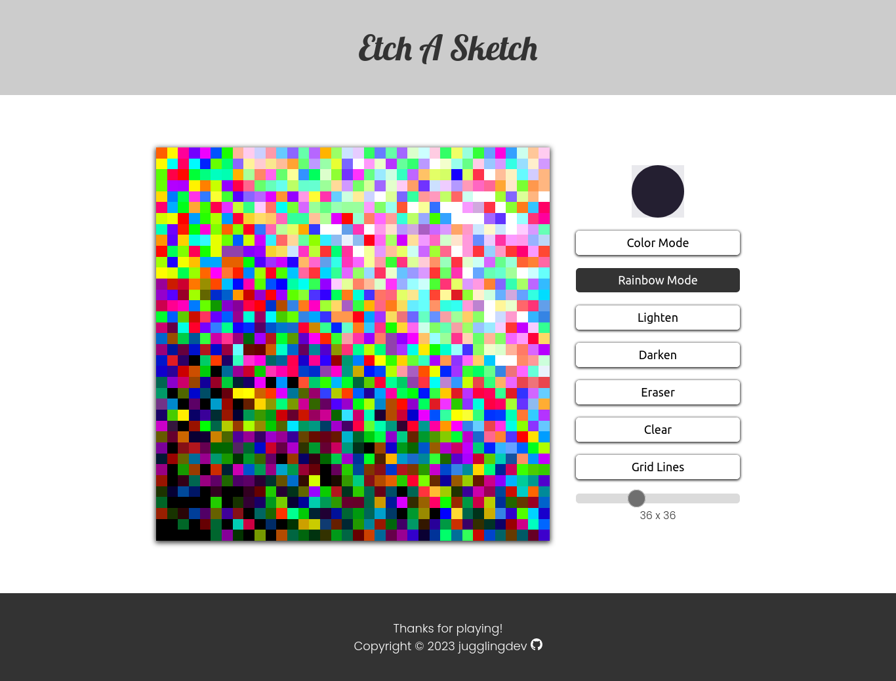

# The Odin Project - Etch-A-Sketch

This is a solution to [Project: Etch-A-Sketch of the Foundations Course](https://www.theodinproject.com/lessons/foundations-etch-a-sketch).

## Table of contents

- [The Odin Project - Etch-A-Sketch](#the-odin-project---etch-a-sketch)
  - [Table of contents](#table-of-contents)
  - [Overview](#overview)
    - [Screenshot](#screenshot)
    - [Links](#links)
  - [My process](#my-process)
    - [Built with](#built-with)
    - [What I learned](#what-i-learned)
    - [Continued development](#continued-development)
    - [Useful resources](#useful-resources)
  - [Author](#author)
  - [Acknowledgments](#acknowledgments)

## Overview

### Screenshot

### Links

- Solution URL: [Project: Etch-A-Sketch solution](https://github.com/jugglingdev/etch-a-sketch)
- Live Site URL: [Project: Etch-A-Sketch live site](https://jugglingdev.github.io/etch-a-sketch/)

## My process

### Built with

- Semantic HTML
- Custom CSS properties
- CSS Flexbox
- CSS Grid
- JavaScript
- Google Fonts

### What I learned

What a fun project!

I really wanted to push myself in this project, so I opted for several different features.  I included color, rainbow, lighten, darken, and eraser modes, a slider to change the grid size, and an option to toggle grid lines on and off.

The color picker was much more simple than I thought.  It was just an `<input type="color">` tag that I customized with CSS.  I did have to watch out for Firefox's settings, but overall, that was pretty easy to deal with.

Similarly, the slider for the grid size was also easy to work with. It was just an `<input type="range">` tag that needed minor doctoring.

Let's talk challenges.  Since JavaScript doesn't deal with pseudo-classes, I had to work with adding and removing classes for the buttons (you can't change the pseudo-class of an element, but you can add and remove an `active` class).  

I categorized the buttons into 3 groups:

  1. Mode (color, rainbow, lighten, darken, eraser)
  2. Clear
  3. Grid Lines

For the first group, only one button can be active at a time.  This allows the user to switch from a color to the lighten mode to the eraser, etc.

The second group, which is just the `Clear` button, is the only button that uses an `:active` pseudo-class.  That's because the button doesn't stay active.  This action doesn't require the mouse to hover over the grid; it happens instantly.

Finally, the `Grid Lines` button works on a toggle.  It does need to show that it's active, but it doesn't require the mouse to hover over each grid item like the modes do.

To make the buttons interactive, I used `transform` and `transition` for `:hover` and `:focus`.  As I said above, while `Clear` had an `:active` pseudo-class, I added and removed an `active` *regular* class through JavaScript for the other buttons to show whether they were on or off.

Out of the 3 groups, the `Grid Lines` button was the trickiest to work.  I ended up setting up the `active` state of the button on a `.toggle`, which would then trigger the `gridItem` borders to show and hide.  I had to have the `makeGrid` function call the `showHideGridLines` function so that the user wouldn't have to turn the grid lines back on if the grid size was updated.

Another challenging part of this project was working with HSL and RGB colors.  I wanted the `Rainbow` mode to only change hue so that there wouldn't be a mix of muddy and pastel colors with bright ones.  This was fairly simple to do with a little research.

When it came to the `Lighten` and `Darken` modes, however, things got trickier.  I soon discovered that when you `.getComputedStyle` of the `backgroundColor`, it's in the RGB format.

So here I was all happy in HSL land, thinking all I needed to do to lighten and darken a grid item color was change the lightness.  That `console.log()` was not fun to see.

After a detour researching how to convert RGB to HSL, all was good.  It did take a bit of effort studying some new syntax, but I'm super happy with the results.

To end on yet another happy note, I finally put into practice a customized cursor like I've mentioned wanting to do in the past.  The paintbrush cursor also became the favicon for the site.  Those little things really do matter.

### Continued development

This project revealed to me that I need to develop my understanding of events.  I used a lot of trial and error in this project to get it built, but I would really like to build my confidence in working with event listeners and mouse actions.

### Useful resources

- [Vahidk GitHub - Color Transform](https://gist.github.com/vahidk/05184faf3d92a0aa1b46aeaa93b07786) - JavaScript code for converting `rgb()` colors to `hsl()`.

- [Seconds of Code - RGB to Array](https://www.30secondsofcode.org/js/s/to-rgb-array/) - Quick snippet on converting the `rgb()` value to an array.

- [CSS Tricks - Cursor](https://css-tricks.com/almanac/properties/c/cursor/) - Neat and brief interactive guide showing different cursor options.

- [PNG Egg - Paintbrush Cursor PNG](https://www.pngegg.com/en/png-nhkyn) - Free PNG for non-commercial use.

- [Custom CSS Cursors and Offset](https://bengammon.co.uk/custom-css-cursors-and-offset/) - Handy explanation of correcting custom cursor offset.

- [Favicon Converter](https://favicon.io/favicon-converter/) - Nifty site to convert your PNGs to favicons and easily grab the code for your HTML header.

## Author

- Kayla Paden - Find me at [GitHub](https://github.com/jugglingdev), [freeCodeCamp](https://www.freecodecamp.org/jugglingdev), [Frontend Mentor](https://www.frontendmentor.io/profile/jugglingdev), [LinkedIn](https://www.linkedin.com/in/kayla-marie-paden)

## Acknowledgments

Shout outs to the following font, icon, and code creators:

- Crang font by [Caveras](https://caveras.net/)
- Download icon by [Debi Alpa Nugraha](https://www.flaticon.com/free-icons/download)
- Bucket icon by [Those Icons](https://www.flaticon.com/free-icons/bucket)
- CTA arrow hover effect by [Shawn Looi](https://codepen.io/shawnlooi/pen/eeXmrQ)
- Converting color codes in JS by [Vahid Kazemi](https://gist.github.com/vahidk)

As always, shout out to everyone at The Odin Project for chipping in to make web development education free and accessible for everyone.  Huge thanks to you all!
